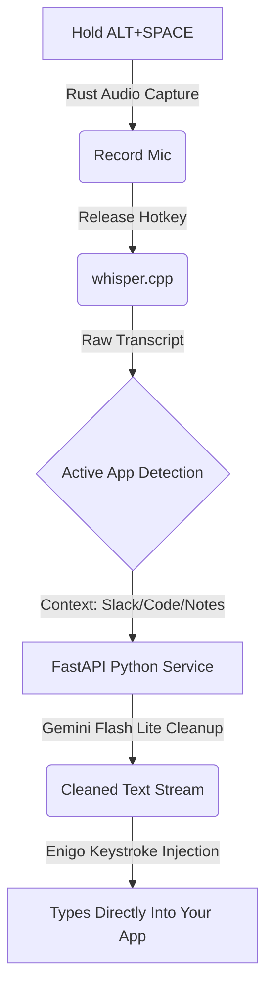

<div align="center">
  <h1>🎙️ SpeakType</h1>
  <p><strong>A lightning-fast, privacy-first, cross-application dictation tool for macOS & Linux.</strong></p>
  
  [](https://rust-lang.org)
  [](https://fastapi.tiangolo.com)
  [](https://github.com/ggerganov/whisper.cpp)
  [](https://ai.google.dev/)
  
  <br />
  <a href="#how-it-works">How it Works</a> •
  <a href="#features">Features</a> •
  <a href="#quick-start">Quick Start</a>
</div>

---

<div align="center">
  
  <p><em>Hold a hotkey anywhere on your desktop, speak, and release. Watch the transcript magically type itself out.</em></p>
</div>

## ✨ Features

- **100% Local Voice Recognition**: Uses `whisper.cpp` to process your voice directly on your device. No audio ever leaves your computer.
- **Context-Aware AI Formatting**: Automatically detects which app you are currently using (e.g., Slack, VS Code, Notes) and uses Google's ultra-fast `gemini-flash-lite` to apply the perfect tone, punctuation, and formatting.
- **Global Hotkey Support**: Works everywhere. You don't need to install app-specific extensions. Just hold `ALT+SPACE` (or your custom hotkey) and start talking.
- **Real-Time Streaming Injection**: Transcribed text streams directly into your active text field as the AI generates it, giving you zero perceived latency.

## 🧠 How it Works



## 🚀 Quick Start

SpeakType is split into two lightweight, decoupled services.

### 1. Build the Whisper Engine
First, clone the local inference engine and download the base model (~140MB):
```bash
./scripts/setup_whisper.sh
```

### 2. Start the AI Cleanup Service
This runs the lightweight Python FastAPI server that handles formatting and context-routing.
```bash
cd cleanup_service
python3 -m venv .venv
source .venv/bin/activate
pip install -r requirements.txt

# Add your Gemini API Key
echo "GEMINI_API_KEY=your_key_here" > .env

# Run the server
uvicorn main:app --host 127.0.0.1 --port 8008
```

### 3. Run the Rust Daemon
The core daemon handles global hotkeys, audio capture, and keystroke injection.
```bash
cd core
cp config.toml.example config.toml # Modify hotkey here if needed
cargo build --release
./target/release/speaktype
```

## 🎯 Usage
Once both services are running:
1. Click into any text field in any application (Slack, Chrome, VS Code, etc.)
2. Hold `ALT + SPACE`
3. Speak normally
4. Release the keys. Your text will instantly stream into the field perfectly formatted!

---
*Built with Rust, Python, and a lot of caffeine.*
