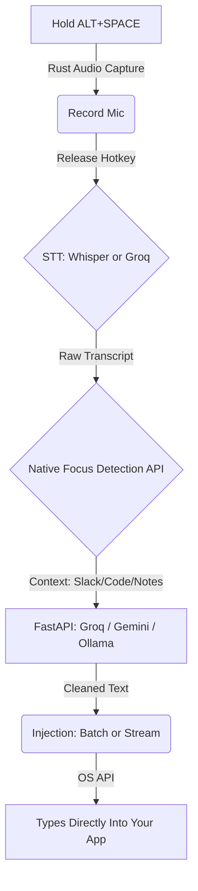

<div align="center">
  <h1>🎙️ SpeakType</h1>
  <p><strong>A lightning-fast, privacy-first, cross-application dictation tool for Windows, macOS, & Linux.</strong></p>
  
  [](https://rust-lang.org)
  [](https://fastapi.tiangolo.com)
  [](https://github.com/ggerganov/whisper.cpp)
  [](https://ai.google.dev/)
  [](https://groq.com/)
  
  <br />
  <a href="#how-it-works">How it Works</a> •
  <a href="#features">Features</a> •
  <a href="#quick-start">Quick Start</a>
</div>

---

<div align="center">
  
  <p><em>Hold a hotkey anywhere on your desktop, speak, and release. Watch the transcript magically type itself out.</em></p>
</div>

## 💡 What is SpeakType?

Imagine having a super-smart assistant that types exactly what you mean, anywhere on your computer. With SpeakType, you just hold a shortcut key (`ALT+SPACE`), speak your mind naturally, and let go. 

The app instantly types out your words directly into whichever app you are using—whether you're sending a casual text in WhatsApp, drafting a professional email in Outlook, or brainstorming in Apple Notes. It automatically understands the context of the app you're in and formats your spoken words perfectly to match the situation, all while keeping your raw voice recordings 100% private and on your device.

## ✨ Features

- **Configurable STT Engine**: Use `whisper.cpp` for 100% local, private voice recognition, or plug in the **Groq Whisper API** for ultra-fast cloud transcription.
- **Context-Aware AI Formatting**: Automatically detects which app you are currently using (e.g., Slack, VS Code, Notes) and uses your LLM of choice (**Groq**, **Gemini**, or local **Ollama**) to apply the perfect tone, punctuation, and formatting.
- **Global Hotkey Support**: Works everywhere. You don't need to install app-specific extensions. Just hold `ALT+SPACE` (or your custom hotkey) and start talking.
- **Smart Text Injection**: Choose between `batch` (instant clipboard paste, immune to autocorrect) or `stream` (real-time visual keystroke injection).

## 🧠 How it Works



## ⚡ Performance & Trade-offs

SpeakType's architecture allows you to customize the pipeline based on whether you value speed, privacy, or accuracy.

| Component | Option | Est. Latency | Trade-off |
| :--- | :--- | :--- | :--- |
| **STT (Whisper)** | `base.en` model (Local) | **~150-200ms** | 100% Private, blazing fast, slightly less accurate on complex words |
| **STT (Whisper)** | `small.en` model (Local) | ~500ms | Highly accurate, noticeably slower on CPU |
| **STT (Groq)** | **Groq API** | ~400ms | Cloud-based, near-instant inference but incurs network upload overhead |
| **LLM (Cleanup)** | **Groq API** | **~400-500ms** | Cloud-based (sends text to Groq), incredible reasoning and speed |
| **LLM (Cleanup)** | Local Ollama | ~800ms+ | 100% Private (local), but weaker reasoning (struggles to format text without chatting) |
| **LLM (Cleanup)** | Gemini Flash | ~1200-1500ms | Cloud-based, excellent reasoning, moderate speed |

*Note: Local STT latency scales linearly with the length of your audio since we transcribe the entire block at once after you release the hotkey.*

### 🏆 The "God Tier" Combination (Sub-800ms latency)
For the absolute best balance of speed, privacy, and accuracy, we recommend:
1. **STT:** `whisper` using the `base.en` model (with Metal enabled on Mac).
2. **LLM:** `groq` using the `llama-3.3-70b-versatile` model.

*Why?* The local STT avoids network upload overhead for the heavy audio file (transcribing locally in <200ms), while the Groq LLM easily handles the text cleanup in <500ms.

## 🚀 Quick Start

## 🚀 Quick Start (For Developers)

SpeakType is split into two lightweight services (Whisper STT and Python FastAPI) managed by a Rust daemon. We've included a unified startup script that automatically builds, configures, and boots everything for you.

```bash
# 1. Configure your API Keys (Optional if using local STT/LLM)
cp core/config.toml.example core/config.toml
cp cleanup_service/.env.example cleanup_service/.env
# Edit them to add your Groq/Gemini API keys if desired.

# 2. Boot the entire stack
./start.sh
```

**That's it!** The script will:
- Check for and build the local `whisper-server` if missing.
- Set up the Python virtual environment and install dependencies.
- Compile and start the Rust daemon in the foreground.
- Safely kill all background services when you press `CTRL+C`.

## 🎯 Usage
Once both services are running:
1. Click into any text field in any application (Slack, Chrome, VS Code, etc.)
2. Hold `ALT + SPACE`
3. Speak normally
4. Release the keys. Your text will instantly stream into the field perfectly formatted!

### 4. Logs and Troubleshooting
The Rust daemon writes daily rolling logs to `core/logs/speaktype.log.*`. If the daemon fails to start or a hotkey press is ignored, check these logs for detailed error messages.

---
*Built with Rust, Python, and a lot of caffeine.*
